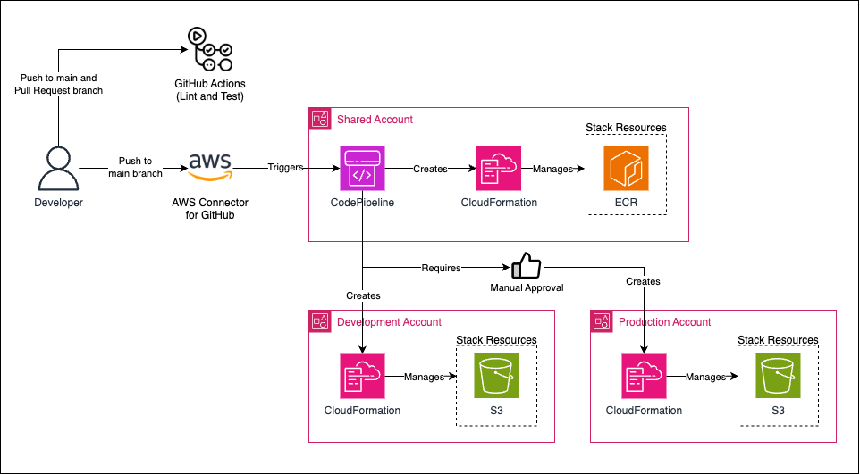

# CDK Multi Account
This repository explain how to deploy to a multi-account architecture in AWS using AWS CDK as Infrastructure as Code tool.



## Tools
Several tools were used in this repository:
1) At a higher level:
- [Devbox](https://www.jetify.com/devbox): Creates isolated, reproducible development environments that run anywhere
- [CDK](https://aws.amazon.com/cdk/): Defines the AWS infrastructure using code (chosen programming language was Typescript)
- [Taskfile](https://taskfile.dev/): A modern approach to Makefile, includes helpful scripts and commands to help setup the environment

2) At a code level
- [Jest](https://jestjs.io/pt-BR/): Used to create snapshot tests for the infrastructure.
- [Eslint](https://eslint.org/): For fixing and linting Javascript code.
- [Prettier](https://prettier.io/): Code formatter for Javascript.

## Using this repository
The only dependency needed to start using this project is [Devbox](https://www.jetify.com/devbox) and [Nix](https://nixos.org/download/) (if you install Devbox first it will install Nix for you if you don't have it), all the other tools will be installed by it.

1) Configure variables
Check `Taskfile.yaml` file and edit `AWS_REGION` and `AWS_SHARED_ACCOUNT` values.

2) Install tools

```sh
devbox shell
```

3) Bootstrap CI-CD/Shared account
Export the AWS credentials (assumed role credentials or IAM user credentials) of the Shared/CI-CD account. This command can run as many time as you want.

```sh
task bootstrap-shared-assets
```

3) Bootstrap CI-CD/Shared account
Export the AWS credentials (assumed role credentials or IAM user credentials) of the workload accounts (development and production account in our case). This command can run as many time as you want.

```sh
task bootstrap-workload
```

5) Create an AWS CodeStar Connection
Follow the [AWS Documentation](https://docs.aws.amazon.com/dtconsole/latest/userguide/connections-create-github.html). This must be performed in the CI-CD/Shared acccount. You must be the owner of the GitHub repository/organization.

Replace the `codeStarConnectionArn` (file `src/config/pipeline.ts`) with the ARN of the connection you just created.

6) Deploy the pipeline stack manually

Export the AWS credentials (assumed role credentials or IAM user credentials) of the Shared/CI-CD account. This command can run as many time as you want.

```sh
yarn cdk deploy MultiAccountStack
```

This deploys the CodePipeline stack that will deploy to all the other environments. After this is deployed no more manual steps needs to be performed, you can start to open pull requests and the deployment will be triggered by the AWS Connector created on the previous step.